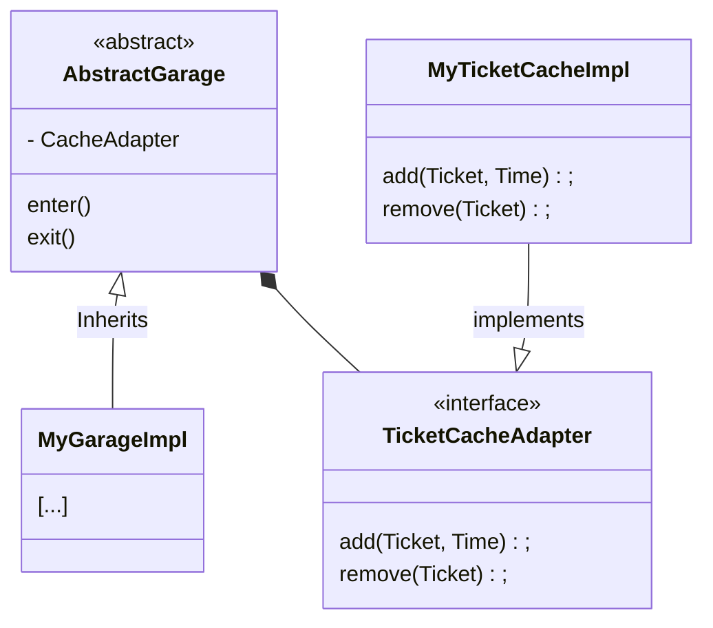

# The Garage Exercise

First off, I want to thank you for your time and your good vibe.
This is a follow-up to the garage exercise that I found very interesting, but for which I feel I was not able to put my thoughts together during the interview.

The first thing I should have asked is, why are we putting this together? Do we anticipate reselling it to third parties in the form of APIs that can be easily extended? Is this a one-off project for a particular client?

The reason this is so important is that the concept of over-engineering is relative. One thing I struggled with in the interview is that I didn't know if I should keep it simple (KISS) or implements fancy design patterns.

## So what did I change?
One of the problems we encountered early on is what should we return when there are no parking spots available? In the absence of software requirements specification (SRS), I decided to deal with this issue idiomatically. I returned an `Optional<T>` to make sure the null pointer is handled correctly by the caller.

At some point in the interview I mentioned that I didn't like the loop in the Garage constructor to initialize the List<Floor>. The garage constructor now takes a `Map<Integer, Floor>` which is more flexible and let the caller deal with the initialization. 

For maximum flexibility we could let the caller of our API has a custom identifier type instead of Integer (e.g. Floors are identified by letters instead of numbers). It would require a bit of refactoring to introduce genericity, but as long as `<K extends Comparable<K>>`, it should work.

One of the flaws of the current architecture is that we don't have a time-based eviction policy (TTL) for our ticket cache because I only used a simple LinkedHashSet. It means that someone could park their car forever in our garage. That's something that cannot be implemented in an hour, but if we were to pursue our exercise, I would probably recommend an application-level cache like [caffeine](https://github.com/ben-manes/caffeine).
 
 ## To conclude
 What if we needed to let the users of our API have their own garage implementation? (e.g.  Garage that automatically route the client to the nearest parking spot available or perhaps let them use a different caching system.)

Perhaps something like that might do the trick:

We could probably come up with an infinite amount of additional requirements, this is what makes software engineering so fun and... painful sometimes. :)

Have a good day !

